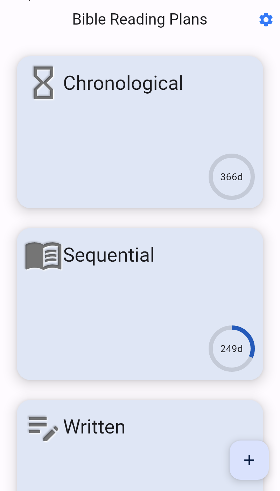
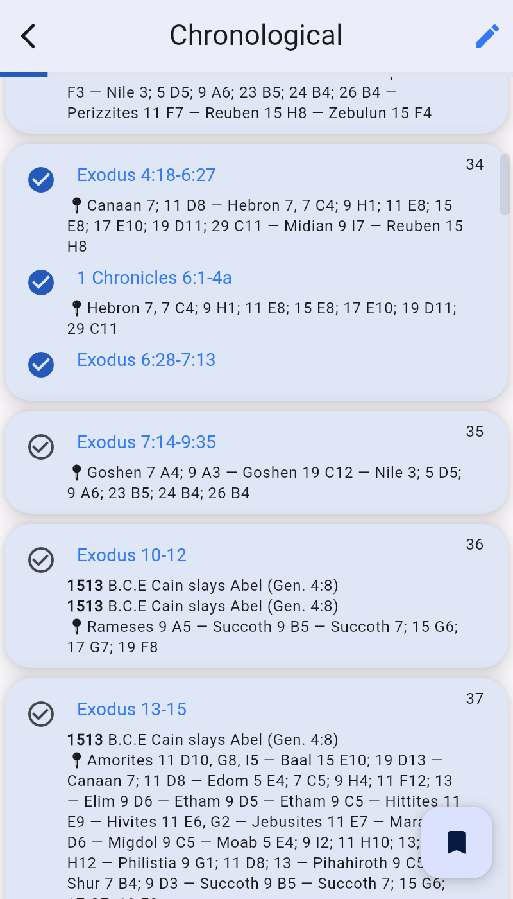
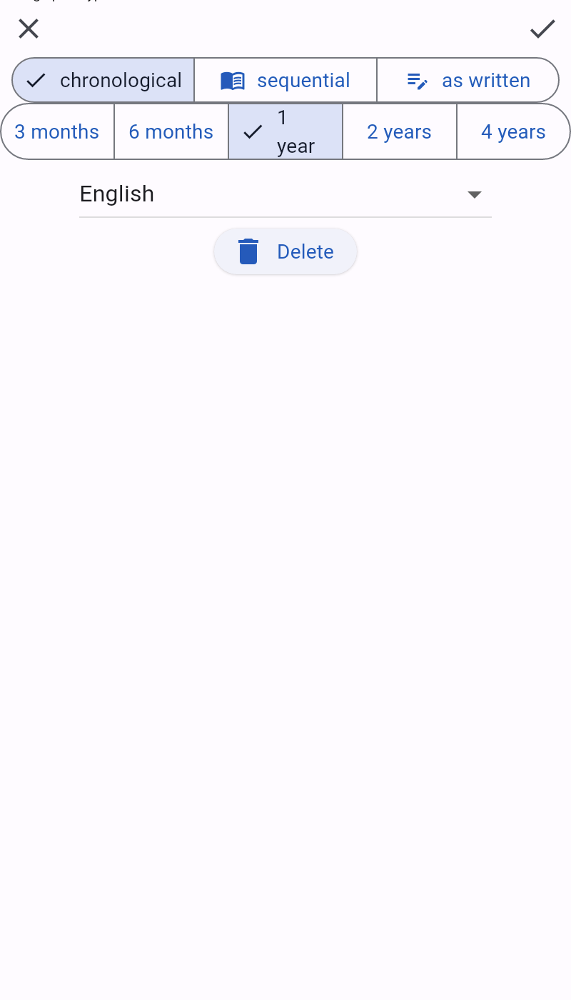

# JW Daily

A Bible reading schedule app for the New World Translation of the Holy Scriptures
for Jehovah's Witnesses.





## Development

Requires the Flutter SDK version pinned in `.github/workflows/` (currently
3.27.4). Newer stable channels are not supported yet — see
[Known limitations](#known-limitations).

```sh
flutter pub get
./gen-i10n.sh   # generates the localization sources; run after editing any .arb
./check.sh      # format, analyze and test — the same gate CI runs
```

`gen-i10n.sh` must run before the first analyze or build, otherwise the
generated `AppLocalizations` and `LocationsLocalizations` classes are missing.

## Known limitations

The project is pinned to Flutter 3.27.x. Moving to a newer stable requires two
migrations that are not done yet:

- `intl` must go to `^0.20.2`, because newer Flutter SDKs pin that version
  through `flutter_localizations`.
- The l10n output moved out of the synthetic `package:flutter_gen`, so
  `gen-i10n.sh` and every `package:flutter_gen/gen_l10n/...` import need to be
  switched to a real output directory.

## License and attribution

JW Daily is licensed under the **GNU Affero General Public License v3.0** — see
[LICENSE](LICENSE).

This app started as a fork of [NWT Reading](https://github.com/searchwork/nwt-reading)
by searchwork.org and remains a derivative work of it. Large parts of the
reading schedules, the location and event data and their translations originate
from that project; the `(c) searchwork.org` notices in `assets/localization/`
mark that material and are kept intentionally.

Because the upstream project is AGPL-3.0, this app and anything derived from it
must stay under the same license, keep the existing copyright notices, and offer
its source to users who interact with it over a network.

The pixel art under `assets/images/lands/` comes from the *Sprout Lands* asset
pack — see `assets/images/lands/read_me.txt` for its terms.
