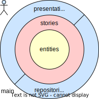

# Architecture

> **Dependency Rule**
>
> - Across architectural boundaries all dependencies point **inwards**, that is towards the domains (the business rules).
> - Inner rings must **not depend on outer rings**.
> - **Sections on the same ring** should not depend on each other. They may use each other indirectly through inner rings.

## Domains

The domains contain the application independent **business rules**.

The data **types** are exposed as **immutable classes** and the **objects** as [Riverpod] [AsyncNotifierProvider] objects called `<model>Provider` or `<model>FamilyProvider`.

[Riverpod]: https://docs-v2.riverpod.dev
[AsyncNotifierProvider]: https://pub.dev/documentation/riverpod/latest/riverpod/AsyncNotifier-class.html

## Stories

The stories contain the user stories, that is **application specific business rules** (specific to the automation).

## Presentation

The presentation layer contains the **user interface** related objects.

## Repositories

Repositories assure **data access and persistence**.
